# Nerd Cave

[View published site on Heroku](https://nerd-cave.herokuapp.com/).


## Project Overview

Nerd Cave is a blog website focus on topics connected to video games consoles, mostly reviews of products/games. Users can interact with each others through post comments. User can become an author if administrator assign staff member permission. Whole CRUD operations are enabled due custom 'Author Panel' avaiable to users with staff member permission. This site has been created as a portfolio project for Code Institute. Project - 4

## Table of Contents

1. [User Experience (UX)](#ux)
    * [Strategy](#strategy)
        * [Project Goals](#project-goals)
        * [User Stories](#user-stories)
    * [Scope](#scope)
    * [Design](#design)
2. [Features](#features)    
   * [Database Structure](#database-structure)
   * [Current Features](#current-features)
   * [Future Features](#future-features)
3. [Technologies Used](#tech-used)
4. [Testing](#testing)
    * [User Stories Testing](#user-testing)
    * [Validation Testing](#validation-testing)
    * [Automated Testing](#auto-testing)
5. [Deployment](#deployment)
6. [Credits](#credits)

## User Experience (UX) <a name="ux"></a>

## Strategy <a name="strategy"></a>

### Project Goals <a name="project-goals"></a>

The business goal for Nerd Cave is to provide users with interactive blog website with consoles oriented stuff reviews. The user can create an account to be able to further interact with these blog posts via likes and adding comments. 

The main target customers/users are people interested in video games & consoles who are looking for reviews of games or accessories before buying them. Ex. 
1. Pro gamers looking for new controller. 
2. Kids looking for new games
3. Parents looking for good gift for theirs kids

### User Stories <a name="user-stories"></a>

* __Site User Goals:__

  * As a User, I can quickly identify what the main blog is about so that I don't have to waste time around
  * As a User, I can browse through the list of posts to find something interesting for me or reread some old posts.
  * As a User, I can read the whole post on a separate page, so that I can enjoy the content
  * As a User, I can like/dislike a post so that share my opinion.
  * As a User, I can add comments to each post so that I can share my opinion with other readers.
  * As a User, I can register to blog so that I can take active contributions to liking/commenting on posts
  * As a User, I can see the 'about page' so that I can learn more about the people behind that website.
  * As a User, I can send a message to site admins so that I can share my thoughts with the site owner(s) or ask to become an Author of the blog


* __Site Owner Goals:__

  * As a Site Admin, I can create, update or delete posts so that I can have control over the content on the website
  * As a Site Admin I can let other users become blog authors so that I can delegate some blog work to other people
  * As a Site Admin I can get messages from users through 'Contact' form.
  * As a Site Admin I can feel safe that authors are only able to edit/delete content that's belongs to them. 


## Scope <a name="scope"></a>

To achieve the strategy goals, I implemented the following features:

* A navigation located at top of the page and also in the footer at the bottom of the page.
* A Home section which will allow the user to find out recent posts from 3 main categories (PS5,XBOX,SWITCH).
* A Contact page to provide users with possibility of contacting site admin.
* An About Us page to provide more information for visitor.
* A SignUp page to allow new users to create an account.
* A SignIn page for existing users to access their account to allow to like and add comments.
* A Logout functionality.
* A Post List page to allowed user search through all posts by category/title/author that were added to blog so far.
* A Post Detail page to view the selected post in more detail and allow adding comments/like the post.
* A Footer at the bottom of the website which is a second navbar and also allows the user to access social media links.
* A fully responsive design that will work on different devices.
* An Error 404 Page to allow users to redirect back to Home page in case of any errors.
* An Error 500 Page to allow users to redirect back to Home page in case of any errors.
* Full CRUD functionality for Admin OR User promoted by Admin to be an Author to allow to create, read, update and delete posts.


## Design <a name="design"></a>

I have used bootstrap 5.2.3 for whole design. Custom CS was reduced to minimum to improve development time. 

To ensure a bit more custom experience than usual bootstrap websites provides I added custom bootstrap theme from [bootswatch.com](https://bootswatch.com/)

That allowed to create simple but futuristic/cyber-punk-ish design.


## Features <a name="features"></a>

### Database Structure <a name="database-structure"></a>

A relational database was used for this project. 

During development was used PostgresSQL as the main database, and for deployment all data was migrated to [ElephantSQL](https://elephantsql.com/).


The database diagram was created using [dbdiagram.io](https://dbdiagram.io/home).

The database contains the following similar models to ones in CI course examples plus one custom model - Contact.

* __Post__: Contains information about posts submitted by admin, has a relationship with the User model.
* __Comment__: Contains information about comments submitted by the user, has a relationship with the Post model.
* __Category__: Contains information about post console related category. Has relation with the Post model
* __Contact__: Contains information about form submitted by a site visitor, has no relationships with other models.
* __User__: This is a Django built-in model, has a relationship with the Post model & Comment model.


### Current Features <a name="current-features"></a>

__Navigation__:

* This feature is present on all the pages/sections and is a part of 'base' html template.
* The navigation logo is located on the left side of navbar and hyperlinks are located on right side.
* Fully created with bootstrap components.
* Below Navigation is a 'Hero' header which is also part of 'base' template.

__Home__:

* This is the default page displayed when the user accesses the website.
* This page can also be viewed by clicking the Nerd Cave logo or the home button from the navigation.
* An introductory message displayed to the user.
* Home page displays latest 4 posts from each category while the newest one is always bigger then the rest.
* Each post is displayed in a card style with an image, author, date, title, category and like & comments count.
* Clicking 'Read More' button will take the user to the Post Details page to display the full content of the post.

__About__:

* User can access this section by clicking the 'About' button from the navigation.
* User is able to learn more about people behind the website and it's purpose.

__Post List__:
* Accessed by the navigation link.
* Displays list of 12 posts per page
* Has a searchbar on right side on desktop and on top on mobile devices
* Searching can be made by post title,author & category

__Sign Up__:
* Sign Up page is a part of django-allauth library used in the project.
* It's got customized by extending it's template with website base template plus few bootstrap classes.

__Sign In__:
* Sign In page is a part of django-allauth library used in the project.
* It's got customized by extending it's template with website base template plus few bootstrap classes.

__Logout__:
* Logout page is a part of django-allauth library used in the project.
* It's got customized by extending it's template with website base template plus few bootstrap classes.

__Footer__:
* Footer is a part of 'base' template and occurs on every page page
* Footer has navigation links to prevent user scrolling to top of the page to change page through top navbar
* Footer has social links to offer following easy following website and it's creator/s on social media's.

__Contact__:
* Contact page has a simple contact form which upon submitting can be accessed only by the website admin in django built-in admin panel

__404 Error Page__:
* Page can be seen only when trying to access pages that doesn't exist
* Template provides short explanation what's happened and provides a link to return to home page. 

__500 Error Page__:
* Page can be seen only when internal server error occur.
* Template provides short explanation what's happened and provides a link to return to home page. 

__Author Panel__:
* Allows users with Author permission (user is a staff member) to see a list of posts created by that Author.
* Create new posts
* Edit old posts
* Delete unwanted posts

__Author Add Post__:
* Page can be reached by Author Panel
* Allows to create new posts with use of Summernote WYSIWYG web text editor
* Author is able to set status of post, assign category, assign post image and set a title & excerpt.
* Slug field is generated automatically

__Author Delete Post__:
* That page is only available through Author Panel.
* It's only a confirmation page
* Page is checking if current User is also an Author of that post which is about to be deleted.
* Upon deleting Author is redirected to Author Panel.

__Features Exclusive to Admin__:
* Built in Django panel at route /admin
__Features Exclusive to Author__:
* Custom build Author Panel allowing CRUD operation on posts created by the Author.

### Future Features <a name="future-features"></a>

Due lack of time I was unable to add option to dislike a post. In future I would like to improve liking system.

Add another button with icon of thumb down and create separate table in db to store if post got reaction. If yes if it was '1' as a like '-1' as a dislike.

Also I am planning to add in Author Panel upon clicking delete on a post instead of redirecting to separate page it would be
way better if upon clicking button bootstrap modal would popup with a confirmation. 

Add more images that would suit my 'Hero' header. Ideally 1 image per page. For blog posts featured image supposed to 
be a header but that would required cropping images, changing brightness and etc.


## Technologies Used <a name="tech-used"></a>

* HTML
* CSS
* Python
* [Bootstrap v5.2.3](https://getbootstrap.com/): 
    * Bootstrap has been used for overall responsiveness of the website
* [Bootswatch](https://bootswatch.com/):
    * Custom theme for bootstrap offering more unique design experience.
* [Django](https://docs.djangoproject.com/en/3.1/): 
    * Django was used as the main framework to build this project.
* [Cloudinary](https://cloudinary.com/): 
    * Cloudinary was used to store all media and static files for this project.
* [dbdiagram](https://dbdiagram.io/):
    * Creating database design.
* [Unsplash](https://unsplash.com/):
    * For images others then posts. Header and about page mostly.
* [Font Awesome](https://fontawesome.com/):
    * Icons used in project like 'comments' icon or 'like' icon comes from there.
* [W3C Markup Validation Service](https://validator.w3.org/): 
    * The W3C Markup Validation was used to validate all of my HTML files.
* [W3C CSS Validation Service](https://jigsaw.w3.org/css-validator/): 
    * The W3C CSS Validation Service was used to validate my custom CSS files.
* [PEP8 Online Validation Service](http://pep8online.com/): 
    * The PEP8 Online Validation Service was used to validate the Python parts of that project.
* [Heroku](https://www.heroku.com/): 
    * Heroku has been used as a hosting provider with connection to Github repository.
* [Github](https://github.com/)
    * Github was used to create a repository which was connected to heroku.
* [HTMLWasher](https://www.htmlwasher.com/)
  * Content for posts was borrowed from other blog websites which are mentioned in Credits.
  * They required cleaning of unnecessary html tags and css classes
* [PyCharm](https://www.jetbrains.com/pycharm/)
    * IDE used for that project.
    * Wanted to try different IDE than Gitpod or VS code.


## Testing <a name="testing"></a>

Testing for this project was completed manually.

### User Stories Testing <a name="user-testing"></a>

User Stories Can be found [here](https://github.com/mich1991/Nerd_Cave/issues?q=is%3Aissue+is%3Aclosed)
. Each User Stories has list of tasks attached to it in description.

Iteration for those User Stories can be found [here](https://github.com/mich1991/Nerd_Cave/milestones?state=closed)

Github project page can be found [here](https://github.com/users/mich1991/projects/5)

#### US-1. As a user, I can quickly identify what the main blog is about so that I don't have to waste time around:
* First thing that user sees upon visiting website is a Hero header with a title 'Latest news from console world . All in one place'.
* Hero has arcade machines as background image.
* Simple navbar that has everything blog would need.
* Home page has each of categories on display and 4 of the recent posts from each of categories to show.
#### US-2. As a user, I can browse through the list of posts to find something interesting for me or reread some old posts:
* All posts page has a list of posts that are paginating per 12 posts
* Searchbar allows user to search posts by the category, title or favourite Author name. 
#### US-3. As a user, I can read the whole post on a separate page, so that I can enjoy the content:
* Post detail page allows user the read the whole content and even more but that would be covered in another user story.
#### US-4. As a user, I can like/dislike a post so that share my opinion.:
* Post detail page allows user to react to a post with a 'Like' button at the bottom of the post
above comment form. User can either like or unlike the post if changed mind.
* Amount of posts likes can be seen on every page with post cards (home page, all posts) and also on the post detail page
* Liking posts is only available to log in users. If not logged in and tried to like the post user is being
redirected to Sign In page.
#### US-5. As a user, I can add comments to each post so that I can share my opinion with other readers.:
* Each user can add comment to a post at the bottom of post detail page if signed in.
* Each user can read all the comments to a post at the bottom of the post detail page.
* Each user can see total number of comments for each post on the post detail page
plus on post card on home page & all posts page.
#### US-6. As a user, I can register to blog so that I can take active contributions to liking/commenting on posts:
* Sign Up and Sign In is clearly visible in navbar. As it's makes the most of sense they are last 2 items
in the navbar.
* Upon Sign Up username and password is required but email is optional.
* Sign In is simple and upon login in user is redirected to home page.
* If user is signed in navbar is getting changed. Sign Up/Sign In option are replaced with Logout route.
* Also with correct permission users might get access to Author Panel 
#### US-7. As a user, I can add like or dislike to a post so that I can share my opinion on the article:
* Due lack of time that functionality wasn't implemented.
* User can only like or unlike the post. There is no way to dislike the post in current implementation.
* Story got abandoned because it's not crucial to blog requirements.
#### US-8. As a Site Admin, I can create, update or delete posts so that I can have control over the content on the website:
* Site Admin has access to built in django admin panel where Admin can do all CRUD operations
* Post adding also includes Summernote WYSIWYG editor. That allows Admin to create decent looking posts.
* Summernote allows to append custom HTML for more experienced users.
* Admin is able to promote users to Author by assigning them as staff_members. Doesn't have to 
assign any other permission so Admin panel is safe.
#### US-9. As a user, I can see the 'about page' so that I can learn more about the people behind that website.:
* Navbar & Footer have a link to about page.
* User can learn more about blog purpose and people behind it.
#### US-10. As a user, I can send a message to site admins so that I can share my thoughts with the site owner(s):
* User can access Contact page through navbar or footer.
* User can fill the form to contact site Admin just by sharing email address , name and a message.
* User can apply for Author position through Contact Form.
#### US-11. As a Site Admin I can let other users become blog authors so that I can delegate some blog work to other people:
* Admin can promote User to Author by adding permission as staff member
* Author has access to custom Author Panel
* Author Panel allows user to create new posts
* Author Panel allows user to edit previous posts that were created by him
* Author Panel allows user to delete previous posts that were created by him
* Author Panel allows user to add status as a 'draft' for post so Author can come
back to it later and finish.

##### All user stories except US-7 which was abandoned due lack of time were implemented with satisfactory results

### Validation Testing <a name="user-testing"></a>

#### 1. HTML - [W3C Markup Validation](https://validator.w3.org/)

1. Home Page
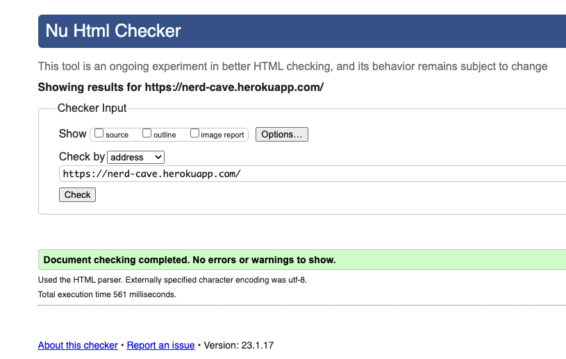
2. All Posts
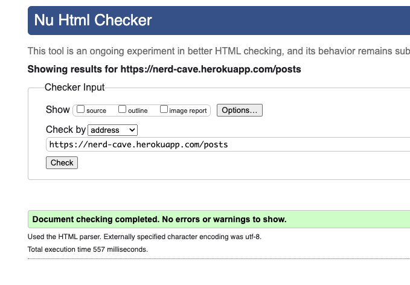
3. Post Detail

4. About
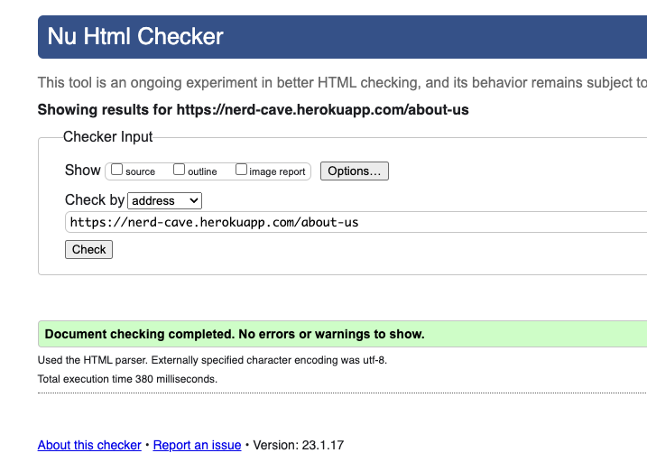
5. Contact
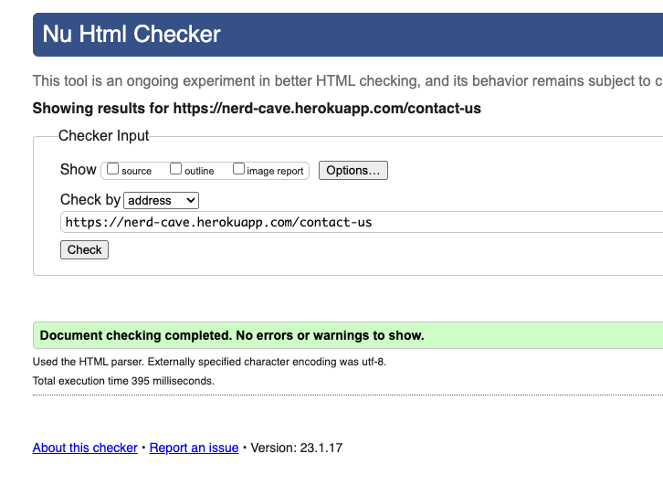
6. Sign Out
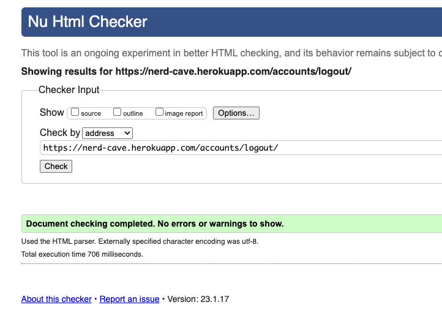
7. Sign In
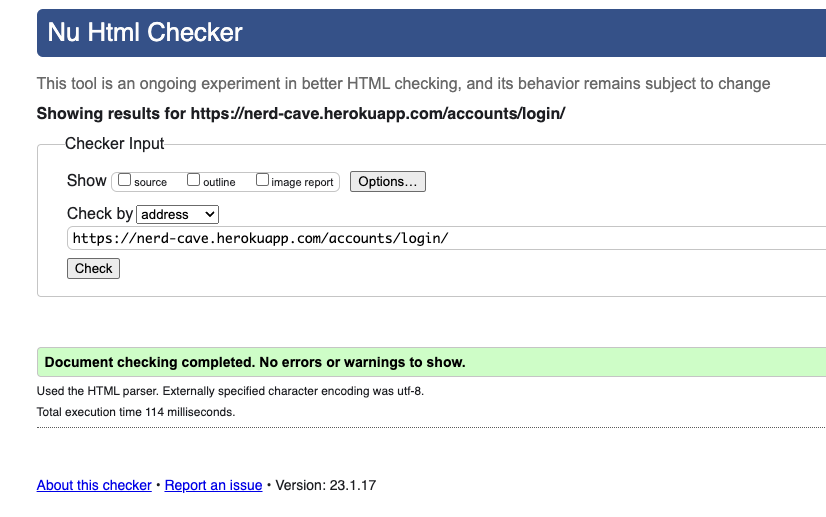
8. Sign Up
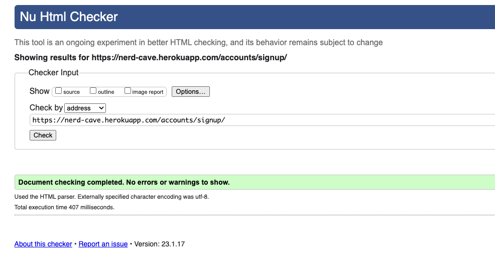
9. Author Post list
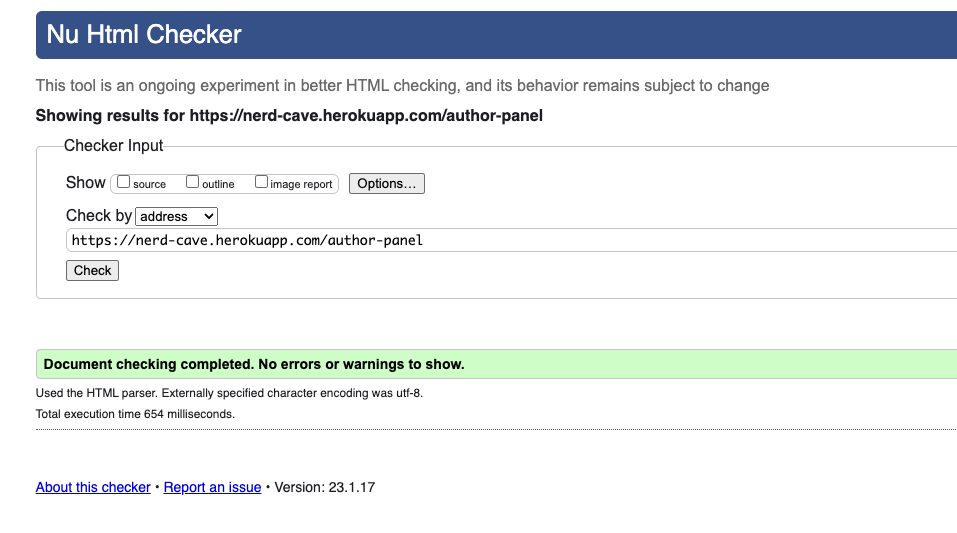
10. Author Add Post
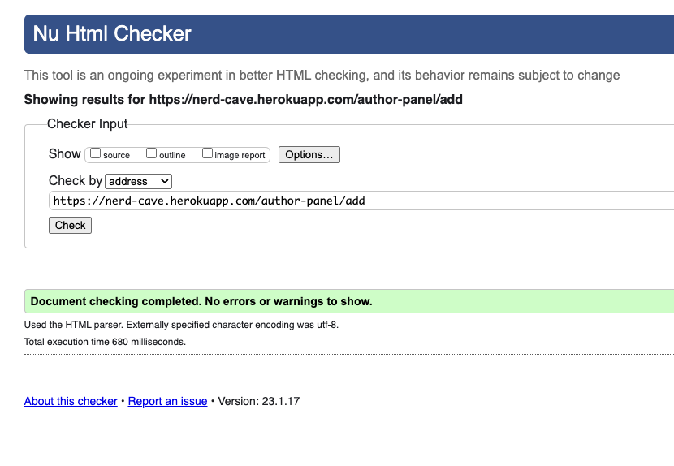
11. Author Edit Post
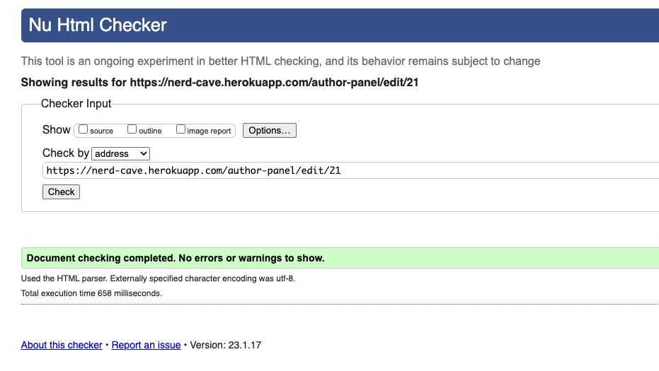
12. Author Delete Post
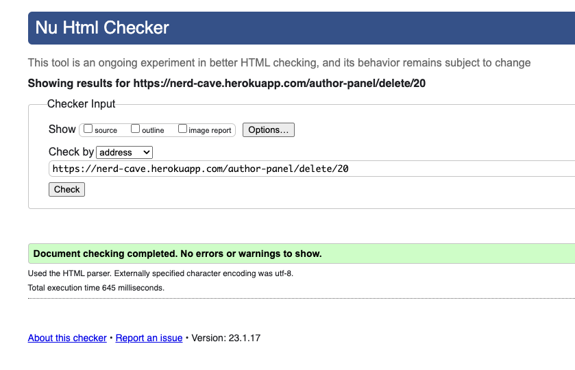

#### 1. CSS - [W3C CSS Validation](https://jigsaw.w3.org/css-validator/)
1. app.css
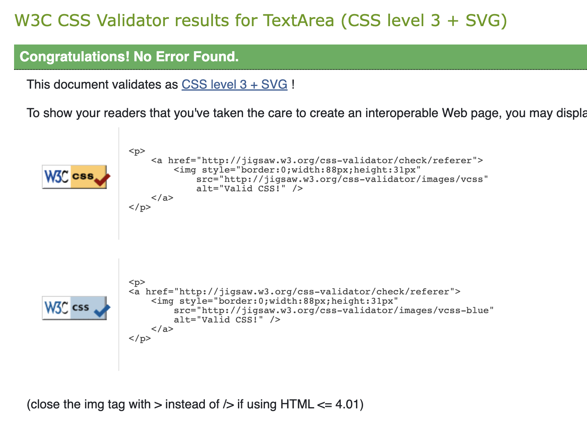
2. auth.css
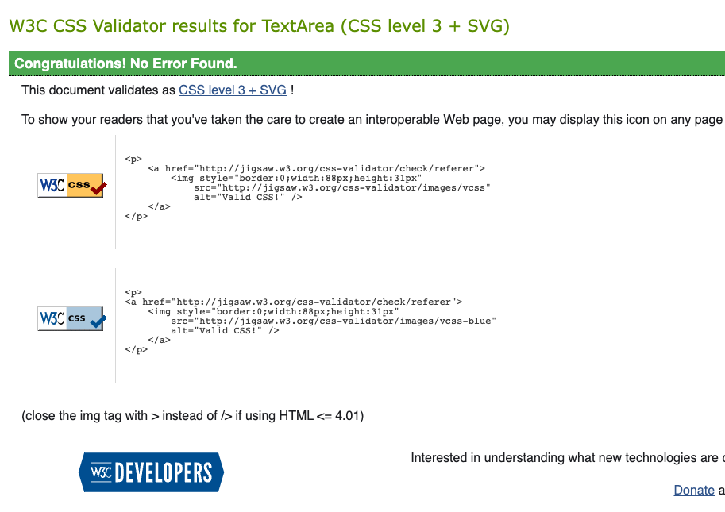
3. author_post.css
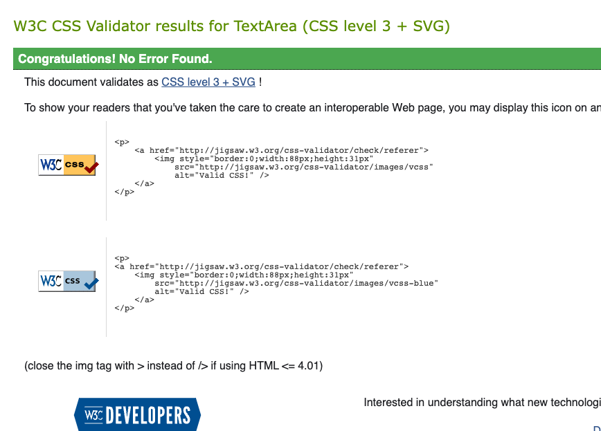
4. index.css
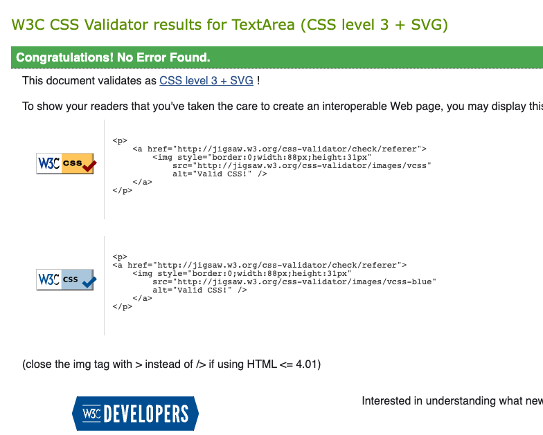
5. post_list.css
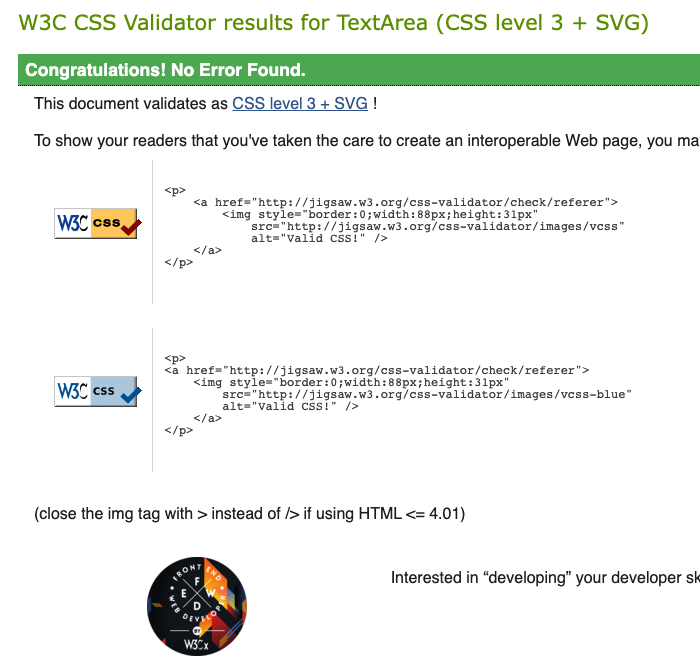
6. post_detail.css
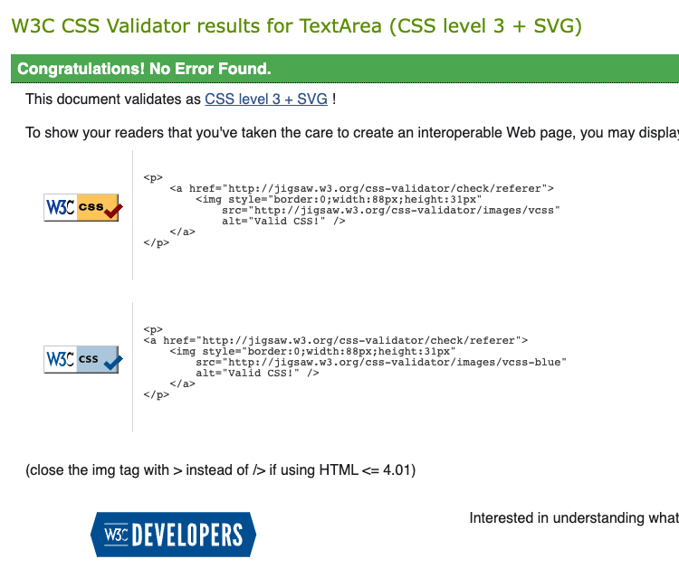


```
posts_used = {
    'xbox' :[
        'https://www.thexboxhub.com/bot-gaiden-review/',
        'https://www.thexboxhub.com/high-on-life-review/',
        'https://www.thexboxhub.com/a-space-for-the-unbound-review/',
        'https://www.thexboxhub.com/gundam-evolution-review/',
        'https://www.thexboxhub.com/the-bounty-huntress-review/',
        'https://www.thexboxhub.com/the-witcher-3-wild-hunt-complete-edition-review/'
    ],
    'switch' : [
        'https://www.nintendolife.com/reviews/switch-eshop/persona-4-golden',
        'https://www.nintendolife.com/reviews/nintendo-switch/fire-emblem-engage',
        'https://www.nintendolife.com/reviews/switch-eshop/lone-ruin',
        'https://www.nintendolife.com/reviews/switch-eshop/the-punchuin',
        'https://www.nintendolife.com/reviews/nintendo-switch/kukoos-lost-pets'
    ],
    'ps5' : [
        'https://www.gameinformer.com/review/crisis-core-final-fantasy-vii-reunion/required-reading',
        'https://www.gameinformer.com/review/tunic/a-dyed-in-the-wool-treasure',
        'https://www.gameinformer.com/review/need-for-speed-unbound/turning-a-tight-corner',
        'https://www.gameinformer.com/review/stranger-of-paradise-final-fantasy-origin/all-rage-no-soul',
        'https://www.gameinformer.com/review/sonic-frontiers/into-the-wild-blue-yonder'
    ]
}
```